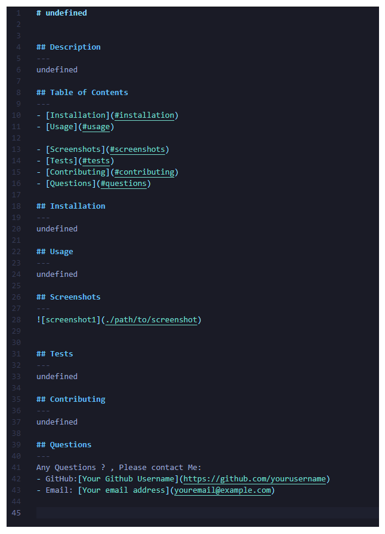

# ReadMe-Generator
Professional README Generator for week 9 challenge

## Description

I was tasked with my ninth challenge to make a README Generator.

- I was able to problem solve and fix code.
- I learned how to use NPMs 
- I learned how to work better in terminal ( work in progress )
- I learned how to work with node
- I learned the importance of README files 

**Note**: A README file enhances the usability, accessibility, and collaboration of a project. It serves as the main source of information, allowing users and developers to quickly understand and engage with the project.

I followed the criteria below provided by the class instructors.

## User Story

- AS A developer
- I WANT a README generator
- SO THAT I can quickly create a professional README for a new project

## Acceptance Criteria

- GIVEN a command-line application that accepts user input
- WHEN I am prompted for information about my application repository
- THEN a high-quality, professional README.md is generated with the title of my project and sections 
-  entitled Description, Table of Contents, Installation, Usage, License, Contributing, Tests, and Questions
- WHEN I enter my project title
- THEN this is displayed as the title of the README
- WHEN I enter a description, installation instructions, usage information, contribution guidelines, and test instructions
- THEN this information is added to the sections of the README entitled Description, Installation, Usage, Contributing, and Tests
- WHEN I choose a license for my application from a list of options
- THEN a badge for that license is added near the top of the README and a notice is added to the section of the README entitled License that explains which license the application is covered under
- WHEN I enter my GitHub username
- THEN this is added to the section of the README entitled Questions, with a link to my GitHub profile
- WHEN I enter my email address
- THEN this is added to the section of the README entitled Questions, with instructions on how to reach me with additional questions
- WHEN I click on the links in the Table of Contents
- THEN I am taken to the corresponding section of the README

 **Note**: Im not a fan of back end hahah.

## Mock-Up

The following image shows the web application after I edited the code.

**Note**: This image is a screen shot once I finished the assisnment.

## Credits
- [W3School - NODE ](https://www.w3schools.com/nodejs/default.asp)
- [Youtube - Node ](https://www.youtube.com/watch?v=pkg0J6lpKT4)
- [ReadMe Editor](https://readme.so/)

### License Images used 
- [MIT License:](https://img.shields.io/badge/License-MIT-yellow.svg)
- [GNU GPLv3:](https://img.shields.io/badge/License-GPLv3-blue.svg)
- [Apache License 2.0:](https://img.shields.io/badge/License-Apache%202.0-blue.svg)
- [ISC License: License:](https://img.shields.io/badge/License-ISC-blue.svg) 
- [BSD 2-Clause "Simplified" License:](https://img.shields.io/badge/License-BSD%202--Clause-orange.svg)

**Note**: User story and acceptance criteria was provided to me in class
 UNB-VIRT-FSF-PT-04-2023-U-LOLC for Week 3 Challenge. 

## My Github

- [Github](https://github.com/xNoirNightx/Password-Generator)
- 

## License

MIT